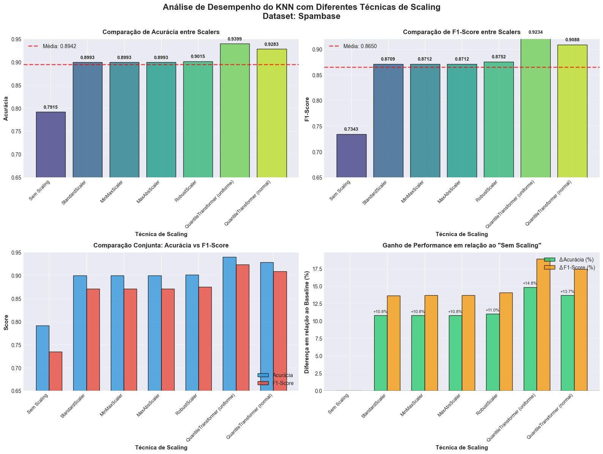
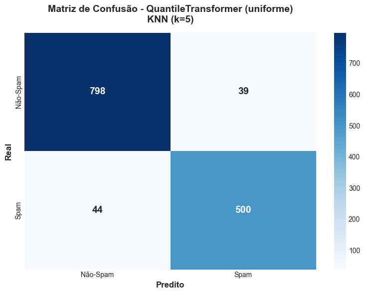

# 📊 Análise de Scaling no KNN - Dataset Spambase

> **Atividade Prática - CIN0208 Ciência de Dados**  
> Análise do impacto de técnicas de normalização/padronização no desempenho do algoritmo K-Nearest Neighbors (KNN)

## 🎯 Objetivo

Avaliar como diferentes técnicas de **scaling** (normalização e padronização) afetam o desempenho do algoritmo KNN em um problema de classificação de spam.

## 📁 Dataset

- **Nome:** Spambase
- **Fonte:** [OpenML (ID: 44)](https://www.openml.org/search?type=data&id=44)
- **Instâncias:** 4.601 emails
- **Features:** 57 variáveis numéricas (frequências de palavras e caracteres)
- **Target:** Binária (0 = Não-Spam, 1 = Spam)
- **Distribuição:** 60,6% Não-Spam | 39,4% Spam

## 🔧 Técnicas de Scaling Testadas

1. ❌ **Sem Scaling** (baseline)
2. 📏 **StandardScaler** - Padronização (média=0, desvio=1)
3. 📐 **MinMaxScaler** - Normalização [0, 1]
4. 📊 **MaxAbsScaler** - Escala por valor absoluto máximo
5. 🛡️ **RobustScaler** - Robusto a outliers (usa mediana e IQR)
6. 📈 **QuantileTransformer (uniform)** - Distribuição uniforme
7. 📉 **QuantileTransformer (normal)** - Distribuição normal

## 📊 Resultados

### Tabela de Performance

| Scaling | Acurácia | F1-Score | Ganho vs Baseline |
|---------|----------|----------|-------------------|
| **QuantileTransformer (uniforme)** | **93,99%** | **92,34%** | **+14,8%** 🏆 |
| QuantileTransformer (normal) | 92,83% | 90,88% | +13,7% |
| RobustScaler | 90,15% | 87,52% | +11,0% |
| StandardScaler | 89,93% | 87,09% | +10,8% |
| MinMaxScaler | 89,93% | 87,12% | +10,8% |
| MaxAbsScaler | 89,93% | 87,12% | +10,8% |
| Sem Scaling | 79,15% | 73,43% | - |

### 📈 Visualizações

<div align="center">
  
  <p><i>Figura 1: Análise comparativa de desempenho com diferentes scalers</i></p>
</div>

<div align="center">
  
  <p><i>Figura 2: Matriz de confusão do melhor modelo (QuantileTransformer uniforme)</i></p>
</div>

## 🔑 Principais Conclusões

### ✅ O que Funcionou

- ✨ **QuantileTransformer (uniforme)** foi a melhor técnica, alcançando **93,99% de acurácia**
- 📈 Ganho de **14,8 pontos percentuais** em relação ao modelo sem scaling
- 🎯 Excelente equilíbrio entre Precision (94%) e Recall (94%)
- 🔍 Apenas **6% de taxa de erro** no conjunto de teste

### 💡 Insights

1. **Scaling é CRÍTICO para KNN**: Diferença de até 15% na acurácia
2. **QuantileTransformer lida melhor com distribuições assimétricas**: Ideal para datasets com outliers e features não-gaussianas
3. **KNN é sensível à escala**: Algoritmos baseados em distância exigem features na mesma escala
4. **Encoding não foi necessário**: Todas as features eram numéricas

### 🎓 Lições Aprendidas

- 📏 **Sempre aplicar scaling** em algoritmos baseados em distância (KNN, SVM)
- 🔍 **Analisar a distribuição dos dados** antes de escolher o scaler
- 🎯 **Múltiplas métricas** (Acurácia + F1-Score) fornecem visão completa
- ⚖️ **QuantileTransformer** é excelente para dados não-normais

## 📦 Dependências

```txt
numpy>=1.24.0
pandas>=2.0.0
scikit-learn>=1.3.0
matplotlib>=3.7.0
seaborn>=0.12.0
```

## 📂 Estrutura do Projeto

```
knn-spambase-analysis/
│
├── analise_knn_spambase.ipynb    # Notebook principal
├── atividade_CIN0208.pdf         # Arquivo da Atividade
├── relatorio_knn_spambase.pdf    # Relatório em PDF
│
├── resultados/
│   ├── resultados_knn_spambase.png
│   └── matriz_confusao_melhor_modelo.png
│
├── dataset_spambase/
│   ├── spambase.data
│   ├── spambase.DOCUMENTATION
│   └── spambase.names
│
└── README.md                     # Este arquivo
```

## 📈 Métricas Detalhadas (Melhor Modelo)

```
QuantileTransformer (uniforme) + KNN (k=5)

              precision    recall  f1-score   support
    Não-Spam       0.95      0.95      0.95       837
        Spam       0.93      0.92      0.92       544

    accuracy                           0.94      1381
   macro avg       0.94      0.94      0.94      1381
weighted avg       0.94      0.94      0.94      1381
```

**Matriz de Confusão:**
- Verdadeiros Negativos: 798
- Falsos Positivos: 39 (4,7%)
- Falsos Negativos: 44 (8,1%)
- Verdadeiros Positivos: 500

---  
  **⭐ Se este projeto foi útil, considere dar uma estrela!**
  
  
  
</div>
